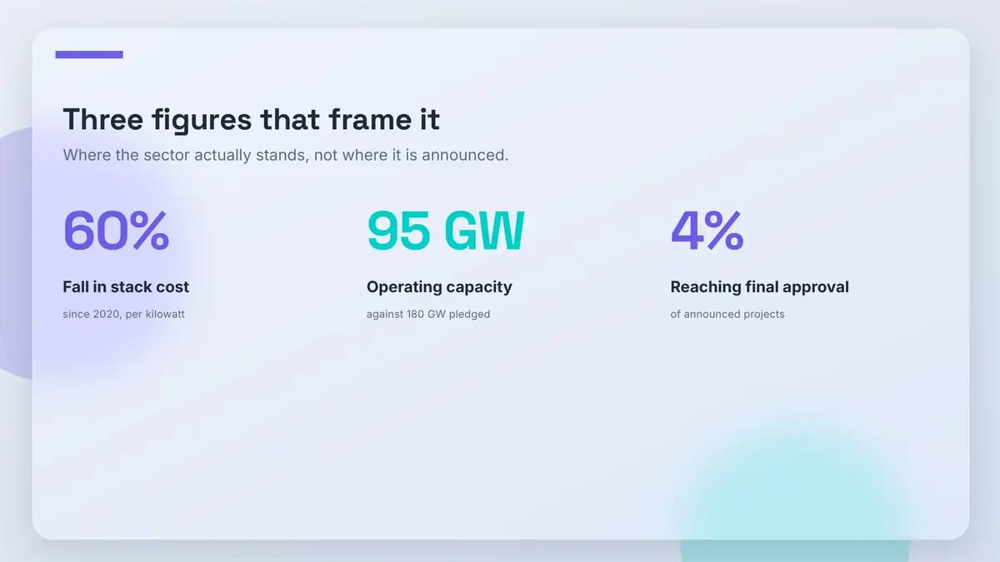
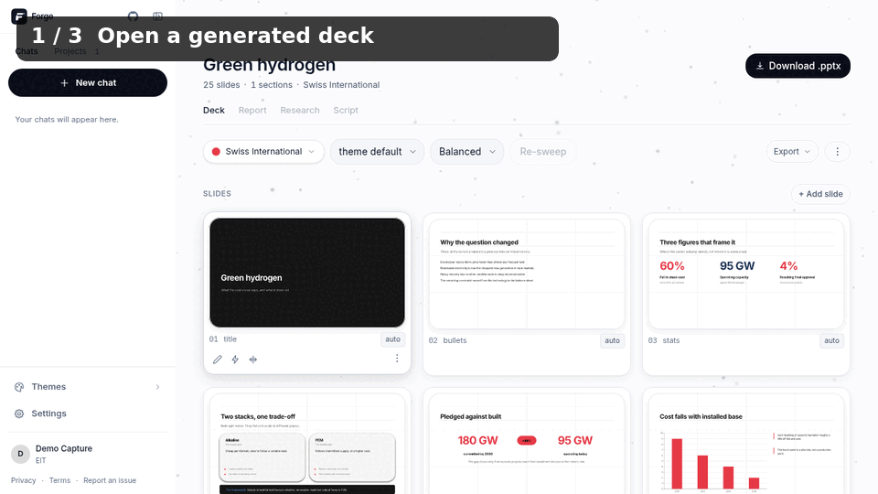
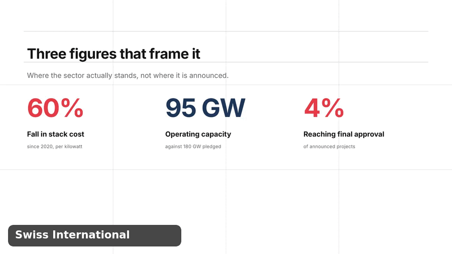

# Presentation Forge

<p align="center">
  
</p>

<p align="center">
  <strong>A topic goes in. A themed deck and a graded report come out.</strong><br />
  Local-first presentation and report generation for academic work.
</p>

<p align="center">
  <a href="LICENSE"></a>
  
  
  
  
  
</p>

| Glassmorphism — a frosted plate, rendered in Chrome | Swiss International — a dense KPI slide |
|:---:|:---:|
|  |  |

Every image in this README is a real render from the repository, produced by the
same code path a generated deck goes through — not a mockup. The left one is a
*plate*: a background Chrome renders as an image because PowerPoint cannot draw
frosted glass, with the text still native and editable on top of it.

| A real local app session — project workspace → slide viewer |
|:---:|
|  |

Captured from the local Docker bundle using the public Green Hydrogen deck in
this repository. It shows opening and inspecting existing work, **not a
fabricated live-generation run**. [Download the MP4](app/gallery/landing/app-workflow.mp4).

---

## The rule that makes it work

**The model never writes layout.** Asking a language model for coordinates and
font sizes fails the moment content changes length. So it cannot express them:

| Layer | Owns | Written by |
|---|---|---|
| **chrome** | crest, banner, presenter line, slide number | locked code in `src/chrome.js` |
| **theme** | palette, type, spacing, shape | human-authored `themes/*.yaml` |
| **content** | what the slides say | the model, as schema-validated YAML |

The model picks a semantic slide *type* and writes its content. It cannot supply
a coordinate, a hex value, or a font name — those keys do not exist in the
schema it is decoding against.

Which is what makes this possible. **The same slide, same words, four themes:**

| Swiss International | Neubrutalism |
|:---:|:---:|
|  |  |
| **Editorial Magazine** | **Sci-Fi HUD** |
|  |  |

Nothing in the content changed between those four. Switching theme is one field
in `deck.yaml`, and 34 of them ship.

| One slide, four themes — 6-second loop |
|:---:|
|  |

This is a real render loop, not a product simulation: the same slide content is
rendered by four design languages. [Download the MP4](app/gallery/landing/theme-system.mp4).

---

## The pipeline

```text
brief → research → outline → HUMAN GATE → content → validate → render → preview → critique
         notes.md   plan.yaml              deck.yaml           .pptx     PNGs
                                                               .docx
```

The gate is deliberate: nothing renders until a person has read the outline and
approved it. Everything after it is deterministic or checked.

- **Research** from SearXNG, arXiv, Crossref, or your own uploaded documents.
  Claims are checked back against the saved notes before a deck is finalised.
- **Per-slide retrieval.** Each slide is shown the research *that slide* needs
  rather than the whole corpus — which is both cheaper and better writing.
- **Rendered, then read back.** A written `.pptx` proves only that the file
  parsed. Slides are rasterised and the text read off the image, because
  `pres.writeFile()` succeeds happily for text running off the canvas.
- **A vision critic** looks at the rendered PNGs and fixes what it sees.

---

## The vocabulary

74 slide types. The model chooses among them by what the content *is* — a
comparison becomes a comparison layout, not a bulleted list about comparing.

| `timeline` | `compare` | `chart` |
|:---:|:---:|:---:|
|  |  |  |
| **`pyramid`** | **`matrix`** | **`flow`** |
|  |  |  |
| **`table`** | **`funnel`** | **`big-number`** |
|  |  |  |

**Text stays editable.** `freeform` is the one type rasterised whole — it is the
deliberate exception, where the model writes the slide as HTML. A *plate* theme
is not the same thing: Chrome renders only the decorative background to a PNG,
and every word on top of it is still native PowerPoint text you can select and
retype.

---

## Real output

Decks and reports made with this app, committed so you can open them without
running anything:

| Presentation | Size | Files |
|---|---|---|
| **Recent Trends in Mixed-Mode Programming** | 21 slides + report | [PPTX](./published/recent-trends-mixed-mode-presentation.pptx) · [DOCX](./published/recent-trends-mixed-mode-report.docx) |
| **First Impressions & Networking** | 20 slides + report | [PDF](./published/first-impressions-networking-presentation.pdf) · [PPTX](./published/first-impressions-networking-presentation.pptx) · [DOCX](./published/first-impressions-networking-report.docx) |
| **First Impressions & Networking**, a second run | 20 slides | [PPTX](./published/first-impressions-topic2-presentation.pptx) |

Browse [`published/`](./published/). Private decks live in `decks/<slug>/` and
are gitignored.

---

## Reports are the other half

The deck is free and themed; the report is rigid and **graded against an
institutional template**. Your department's `.docx` is the donor: the renderer
strips only its body and keeps everything else byte-identical — the watermark
in the header, the footer's page field, the styles, the media.

The section list is read from the donor itself, so a different college's
template is an upload, not a code change. Table-of-contents page numbers are
real: the render is two-pass, converting once to find where each heading lands.

---

## Self-host in one command

**The normal install.** It runs Forge and its private SearXNG research backend
in Docker; Ollama remains your local model runtime, exactly as it does for Open
WebUI. There is no domain, SMTP account, hosted gateway key, TLS setup, or
production secret to supply.

```bash
git clone https://github.com/Deepnar/presentation-forge.git
cd presentation-forge
ollama pull qwen3:4b
docker compose up -d --build
```

Open <http://localhost:8090>, register, choose **New chat**, describe a topic,
answer the briefing, review the outline, then approve it. Your app data lives
in the `forge_local_data` Docker volume; `docker compose down` keeps it, while
`docker compose down -v` deliberately removes it.

This is a private-machine install: it intentionally has no SMTP. Registration
works, but email confirmation and password-reset mail do not; do not expose
this bundle to untrusted or public users. The separate production deployment
adds those controls.

| Requirement | Why |
|---|---|
| Docker Desktop *(Windows/macOS)* or Docker Engine + Compose *(Linux)* | runs Forge, LibreOffice, Chromium, fonts and SearXNG |
| Ollama + an instruction model | runs on the host; Forge connects to it from the container |

On Windows/macOS, Docker Desktop and the Ollama desktop app work as-is. On
Linux, install Docker Compose and Ollama normally; the Compose bundle maps the
host gateway name that Docker Desktop already provides. If the **container
check** below cannot see a model even though `ollama list` works,
start Ollama where Docker can reach it:

```bash
OLLAMA_HOST=0.0.0.0:11434 ollama serve
```

Do this only on a trusted network; it may make Ollama reachable from your LAN.
If Ollama lives on a different trusted machine, point Forge at it explicitly:

```bash
FORGE_OLLAMA_HOST=http://192.168.1.42:11434 docker compose up -d
```

Verify the install after both services settle — no Node install on the host is
needed for this check:

```bash
docker compose exec forge env FORGE_CHECK_URL=http://localhost:5174 node tools/local-check.mjs
```

**BYOK works in this local install too.** Open **Settings → Cloud**, add any
OpenAI-compatible provider key, then choose Cloud in the app. Your decks,
research, accounts and report donor stay in the Docker volume; only model calls
go to the provider you chose. Forge creates a random local encryption pepper in
that volume on first boot, so BYOK keys do not use the published development
default. Ollama remains the default and BYOK is optional.

## Run from source *(contributors)*

Use this only when developing Forge itself rather than using it. It exposes the
Vite UI on :5173 and API on :5174, and expects the renderer prerequisites on
your host:

```bash
npm install
npm run fonts
npm run brand
cp config/identity.example.yaml config/identity.yaml
ollama pull qwen3:4b
npm run dev
```

[`LOCAL_SETUP.md`](LOCAL_SETUP.md) covers the source path, platform-specific
prerequisites and troubleshooting. [`docs/DEPLOY.md`](docs/DEPLOY.md) is the
separate hardened production route — hosted mode, Caddy/TLS, mail, persistent
secrets, administrator controls and tenant limits.

---

## Everyday commands

```bash
npm run dev                                   # API :5174 + UI :5173
npm test                                      # automated test suite

npm run render decks/<slug>/deck.yaml         # content -> .pptx
npm run preview decks/<slug>/out/deck.pptx    # .pptx -> PNGs

npm run themematrix                           # every theme x every type, fit verdicts
npm run textcheck                             # did every word survive onto the page
npm run drawcheck                             # did every field reach the page at all
npm run deckscore <slug>                      # a deck, scored /100
npm run deckscore -- --history                # what previous runs scored

npm run forge -- new "<topic>" --research     # headless: outline
npm run forge -- generate <slug> --critic     # headless: deck
```

The CLI is not a wrapper around the app — both call the same `src/`. The API
layer holds no presentation logic, because the pipeline has to run headless.

---

## Verification that proves something

A written `.pptx` proves the file parsed and nothing else. `pres.writeFile()`
succeeds for decks with text off the canvas and invisible-on-invisible colour
pairs. So the checks ask four different questions, and each was added because
the ones before it were clean on a defect that shipped:

1. **Is the box on the slide?** A geometry watcher runs inside every render.
2. **Was the field drawn at all?** `drawcheck` writes a marker into each field
   and reads back what the layout emitted.
3. **Does the text fit?** `themematrix` across 34 themes × 74 types.
4. **Did it survive the render?** `textcheck` rasterises and reads it back.

None of them replaces looking at the image.

---

## Project map

```text
app/server/       Express transport over the shared core — no logic of its own
app/web/          Vite + React browser application
src/              renderer, pipeline, research, validation, previews, metering
themes/           34 design languages
styles/           reusable token overrides layered over a theme
schema/           the content contracts for decks and reports
templates/        starting content templates
config/           models, identity, accounts, keys
brand/            institutional marks, per operator and per account
app/gallery/      committed theme specimens — the images above
decks/<slug>/     a portable workspace: content, plan, research, output
docker/           image, Compose stack, TLS, SearXNG
docs/             architecture, blockers, economics, roadmap, traps
```

## Data and privacy

No external database. A deck workspace is ordinary files and copies to another
installation.

| Data | Location | Committed? |
|---|---|---|
| Deck content, outline, research, output | `decks/<slug>/` | definitions yes, output no |
| Institution identity | `config/identity.yaml`, `config/identities/` | no |
| Accounts, sessions, keys, usage | `config/forge.db` | no — keys encrypted under `FORGE_KEY_PEPPER` |
| Provider keys (install-wide) | `config/local.yaml` | no |
| Brand assets | `brand/` | no — they may carry protected marks |

With Ollama, model calls never leave the machine. Research providers and an
explicitly chosen hosted provider involve network requests; the deck, the
research and the account data stay local.

**Retention.** Nothing is deleted unless `FORGE_SWEEP_DAYS` is set, and then the
clock is *inactivity*, not age. `GET /api/policy` reports what the running
install actually enforces, so the notice in the app cannot drift from the
scheduler behind it.

## Deployment

```bash
cd docker
cp ../.env.example .env       # FORGE_KEY_PEPPER, SEARXNG_SECRET, FORGE_DOMAIN have no defaults
docker compose -f docker-compose.app.yml --profile tls up -d --build
```

The image carries LibreOffice, Poppler, Chromium and the theme fonts, and builds
for **arm64 as well as amd64**, because the free tiers worth using are ARM.
State lives in the `forge_data` volume.

This workload is **not serverless-compatible** — generation is a multi-minute
stream, rendering shells out to LibreOffice and Chrome, and state is a local
SQLite file plus a directory tree. [`docs/DEPLOY.md`](docs/DEPLOY.md) covers
where it can actually run.

## Further reading

| Doc | Answers |
|---|---|
| [ARCHITECTURE](docs/ARCHITECTURE.md) | how it is built, as built |
| [ROADMAP](docs/ROADMAP.md) | **all** work — done, planned, and why |
| [BLOCKED](docs/BLOCKED.md) | what cannot be worked on, and who can unblock it |
| [ECONOMICS](docs/ECONOMICS.md) | what a deck costs to produce and what it can be sold for |
| [PRODUCTION](docs/PRODUCTION.md) | what stands between here and real users |
| [TRAPS](docs/TRAPS.md) | failure modes that have already bitten |
| [LOCAL_SETUP](LOCAL_SETUP.md) | prerequisites and troubleshooting |

## License

[MIT](LICENSE). Institutional marks, donor templates and assets you add remain
yours and may carry their own restrictions.
