# Presentation Forge

<p align="center">
  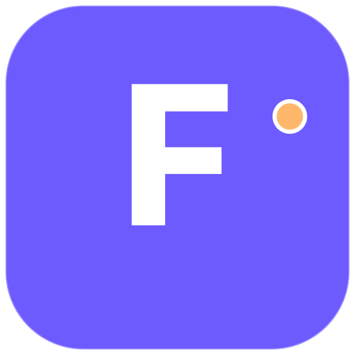
</p>

<p align="center">
  <strong>A topic goes in. A themed deck and a graded report come out.</strong><br />
  Local-first presentation and report generation for academic work.
</p>

<p align="center">
  <a href="LICENSE"></a>
  
  
  
  
  
</p>

<p align="center">
  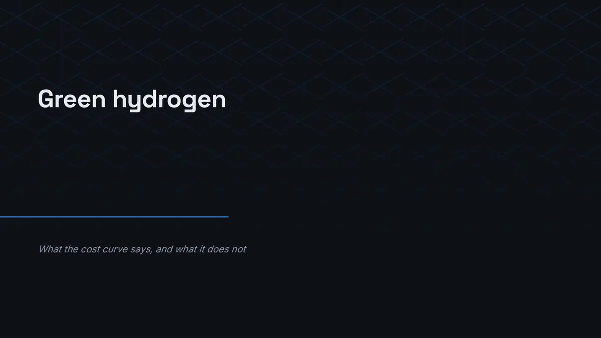
  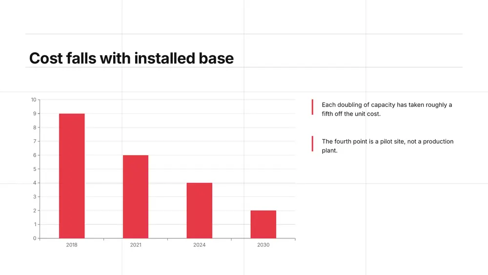
</p>

Every image in this README is a real render from the repository, produced by the
same code path a generated deck goes through — not a mockup.

---

## The rule that makes it work

**The model never writes layout.** Asking a language model for coordinates and
font sizes fails the moment content changes length. So it cannot express them:

| Layer | Owns | Written by |
|---|---|---|
| **chrome** | crest, banner, presenter line, slide number | locked code in `src/chrome.js` |
| **theme** | palette, type, spacing, shape | human-authored `themes/*.yaml` |
| **content** | what the slides say | the model, as schema-validated YAML |

The model picks a semantic slide *type* and writes its content. It cannot supply
a coordinate, a hex value, or a font name — those keys do not exist in the
schema it is decoding against.

Which is what makes this possible. **The same slide, same words, four themes:**

<p align="center">
  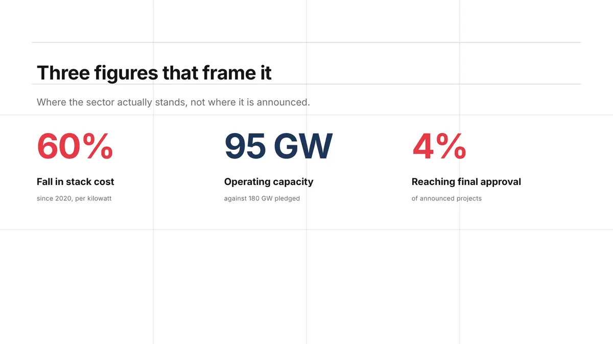
  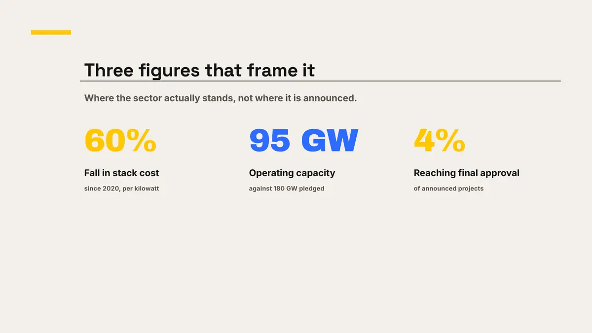
</p>
<p align="center">
  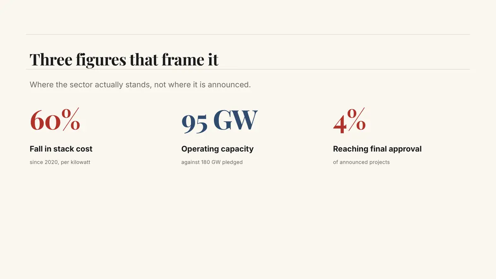
  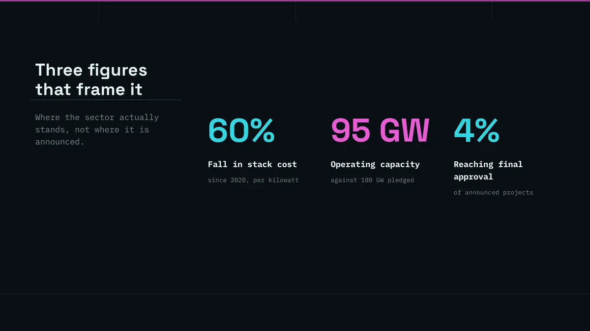
</p>

Nothing in the content changed between those four. Switching theme is one field
in `deck.yaml`, and 34 of them ship.

---

## The pipeline

```text
brief → research → outline → HUMAN GATE → content → validate → render → preview → critique
         notes.md   plan.yaml              deck.yaml           .pptx     PNGs
                                                               .docx
```

The gate is deliberate: nothing renders until a person has read the outline and
approved it. Everything after it is deterministic or checked.

- **Research** from SearXNG, arXiv, Crossref, or your own uploaded documents.
  Claims are checked back against the saved notes before a deck is finalised.
- **Per-slide retrieval.** Each slide is shown the research *that slide* needs
  rather than the whole corpus — which is both cheaper and better writing.
- **Rendered, then read back.** A written `.pptx` proves only that the file
  parsed. Slides are rasterised and the text read off the image, because
  `pres.writeFile()` succeeds happily for text running off the canvas.
- **A vision critic** looks at the rendered PNGs and fixes what it sees.

---

## The vocabulary

74 slide types. The model chooses among them by what the content *is* — a
comparison becomes a comparison layout, not a bulleted list about comparing.

<p align="center">
  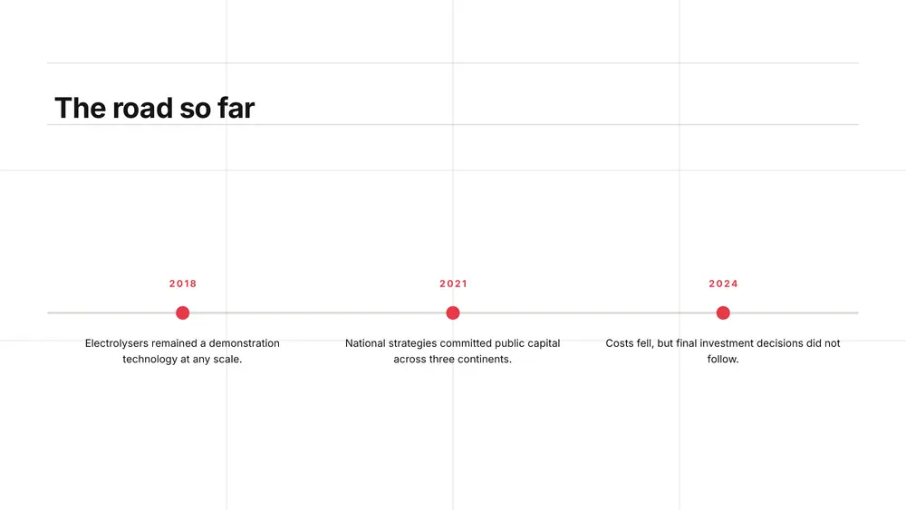
  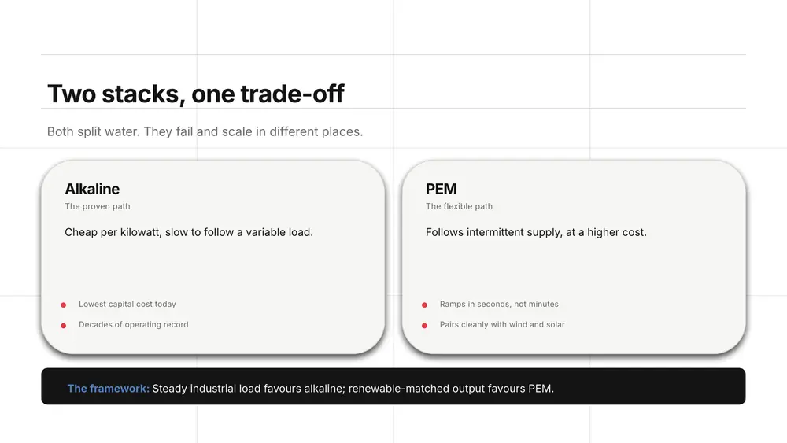
  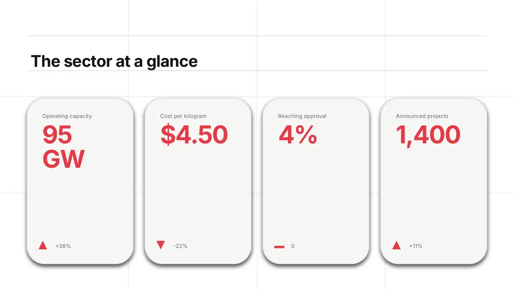
</p>
<p align="center">
  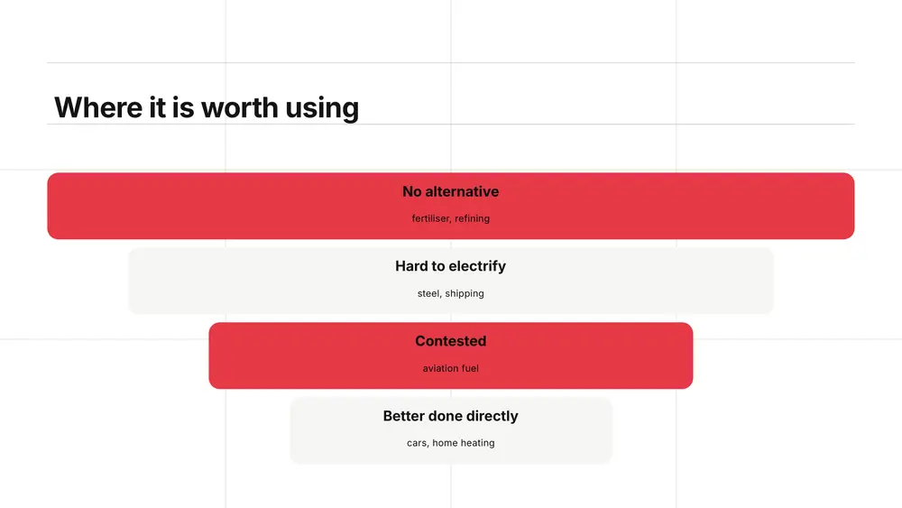
  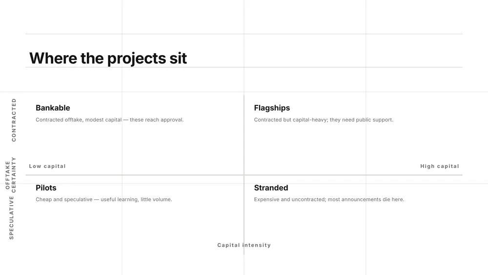
  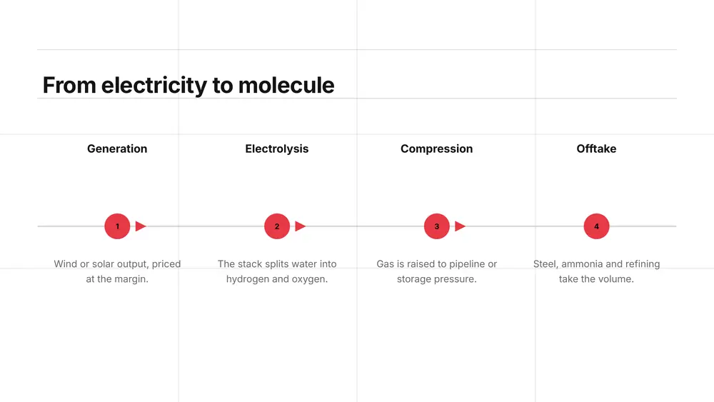
</p>
<p align="center">
  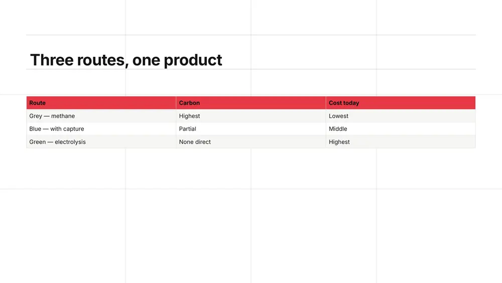
  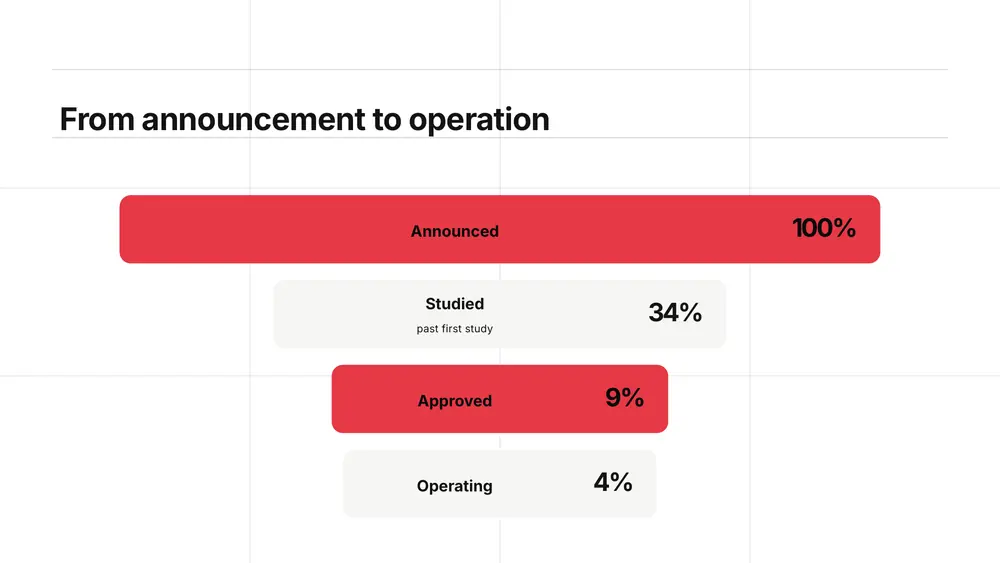
  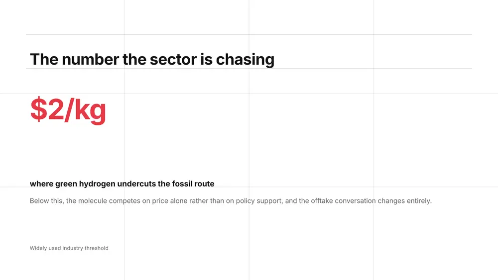
</p>

Native slides keep **editable PowerPoint text**. Only `freeform` and
plate-backed visual treatments are rasterised, and that is a deliberate trade.

---

## Real output

Decks and reports made with this app, committed so you can open them without
running anything:

| Presentation | Files |
|---|---|
| **Recent Trends in Mixed-Mode Programming** — 12 slides + report | [PPTX](./published/recent-trends-mixed-mode-presentation.pptx) · [Report DOCX](./published/recent-trends-mixed-mode-report.docx) |
| **First Impressions & Networking** — variant 1 | [PDF](./published/first-impressions-networking-presentation.pdf) · [PPTX](./published/first-impressions-networking-presentation.pptx) · [Report DOCX](./published/first-impressions-networking-report.docx) |
| **First Impressions & Networking** — variant 2 | [PPTX](./published/first-impressions-topic2-presentation.pptx) |

Browse [`published/`](./published/). Private decks live in `decks/<slug>/` and
are gitignored.

---

## Reports are the other half

The deck is free and themed; the report is rigid and **graded against an
institutional template**. Your department's `.docx` is the donor: the renderer
strips only its body and keeps everything else byte-identical — the watermark
in the header, the footer's page field, the styles, the media.

The section list is read from the donor itself, so a different college's
template is an upload, not a code change. Table-of-contents page numbers are
real: the render is two-pass, converting once to find where each heading lands.

---

## Quick start

```bash
git clone https://github.com/Deepnar/presentation-forge.git
cd presentation-forge
npm install
npm run fonts          # 21 families; a machine without them renders wrong
npm run brand
cp config/identity.example.yaml config/identity.yaml
ollama pull qwen3:4b
npm run dev
```

Open <http://localhost:5173>, register, choose **New chat**, describe a topic,
answer the briefing, review the outline, approve.

| Requirement | Why |
|---|---|
| Node.js 24+ | runs everything |
| Ollama + an instruction model | the default local backend |
| LibreOffice + Poppler | previews, and the report's page numbering |
| Headless Chrome | plate themes and `freeform` slides |
| Docker *(optional)* | the bundled local SearXNG |

```bash
sudo apt install libreoffice poppler-utils    # Debian / Ubuntu
```

`config/identity.yaml` is gitignored — put your institution, guide and team
there without committing them.

**A hosted model is optional.** Configure an OpenAI-compatible provider in
`config/models.yaml`, add the key under **Settings → Cloud**. Keys live in the
ignored `config/local.yaml`; only model requests leave the machine.

---

## Everyday commands

```bash
npm run dev                                   # API :5174 + UI :5173
npm test                                      # 785 tests

npm run render decks/<slug>/deck.yaml         # content -> .pptx
npm run preview decks/<slug>/out/deck.pptx    # .pptx -> PNGs

npm run themematrix                           # every theme x every type, fit verdicts
npm run textcheck                             # did every word survive onto the page
npm run drawcheck                             # did every field reach the page at all
npm run deckscore <slug>                      # a deck, scored /100
npm run deckscore -- --history                # what previous runs scored

npm run forge -- new "<topic>" --research     # headless: outline
npm run forge -- generate <slug> --critic     # headless: deck
```

The CLI is not a wrapper around the app — both call the same `src/`. The API
layer holds no presentation logic, because the pipeline has to run headless.

---

## Verification that proves something

A written `.pptx` proves the file parsed and nothing else. `pres.writeFile()`
succeeds for decks with text off the canvas and invisible-on-invisible colour
pairs. So the checks ask four different questions, and each was added because
the ones before it were clean on a defect that shipped:

1. **Is the box on the slide?** A geometry watcher runs inside every render.
2. **Was the field drawn at all?** `drawcheck` writes a marker into each field
   and reads back what the layout emitted.
3. **Does the text fit?** `themematrix` across 34 themes × 74 types.
4. **Did it survive the render?** `textcheck` rasterises and reads it back.

None of them replaces looking at the image.

---

## Project map

```text
app/server/       Express transport over the shared core — no logic of its own
app/web/          Vite + React browser application
src/              renderer, pipeline, research, validation, previews, metering
themes/           34 design languages
schema/           the content contracts for decks and reports
config/           models, identity, accounts, keys
brand/            institutional marks, per operator and per account
app/gallery/      committed theme specimens — the images above
decks/<slug>/     a portable workspace: content, plan, research, output
docker/           image, Compose stack, TLS, SearXNG
docs/             architecture, blockers, economics, roadmap, traps
```

## Data and privacy

No external database. A deck workspace is ordinary files and copies to another
installation.

| Data | Location | Committed? |
|---|---|---|
| Deck content, outline, research, output | `decks/<slug>/` | definitions yes, output no |
| Institution identity | `config/identity.yaml`, `config/identities/` | no |
| Accounts, sessions, keys, usage | `config/forge.db` | no — keys encrypted under `FORGE_KEY_PEPPER` |
| Provider keys (install-wide) | `config/local.yaml` | no |
| Brand assets | `brand/` | no — they may carry protected marks |

With Ollama, model calls never leave the machine. Research providers and an
explicitly chosen hosted provider involve network requests; the deck, the
research and the account data stay local.

**Retention.** Nothing is deleted unless `FORGE_SWEEP_DAYS` is set, and then the
clock is *inactivity*, not age. `GET /api/policy` reports what the running
install actually enforces, so the notice in the app cannot drift from the
scheduler behind it.

## Deployment

```bash
cd docker
cp ../.env.example .env       # FORGE_KEY_PEPPER, SEARXNG_SECRET, FORGE_DOMAIN have no defaults
docker compose -f docker-compose.app.yml --profile tls up -d --build
```

The image carries LibreOffice, Poppler, Chromium and the theme fonts, and builds
for **arm64 as well as amd64**, because the free tiers worth using are ARM.
State lives in the `forge_data` volume.

This workload is **not serverless-compatible** — generation is a multi-minute
stream, rendering shells out to LibreOffice and Chrome, and state is a local
SQLite file plus a directory tree. [`docs/DEPLOY.md`](docs/DEPLOY.md) covers
where it can actually run.

## Further reading

| Doc | Answers |
|---|---|
| [ARCHITECTURE](docs/ARCHITECTURE.md) | how it is built, as built |
| [ROADMAP](docs/ROADMAP.md) | **all** work — done, planned, and why |
| [BLOCKED](docs/BLOCKED.md) | what cannot be worked on, and who can unblock it |
| [ECONOMICS](docs/ECONOMICS.md) | what a deck costs to produce and what it can be sold for |
| [PRODUCTION](docs/PRODUCTION.md) | what stands between here and real users |
| [TRAPS](docs/TRAPS.md) | failure modes that have already bitten |
| [LOCAL_SETUP](LOCAL_SETUP.md) | prerequisites and troubleshooting |

## License

[MIT](LICENSE). Institutional marks, donor templates and assets you add remain
yours and may carry their own restrictions.
